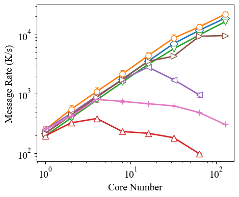
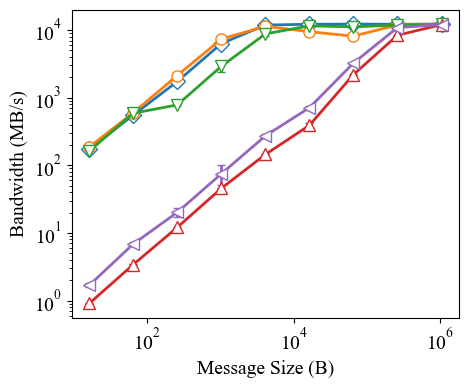
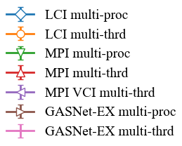

# LCI

A Lightweight Communication Interface for Asynchronous Multithreaded Systems

## Documentation
See [here](https://uiuc-hpc.github.io/lci/) for quick start, tutorial, API documentation, and more.

## Overview
LCI is designed to be an efficient communication library
for asynchronous communications in multithreaded environments. It also serves as a research tool to 
explore design choices for such libraries. It has the following major features:
- a unified interface that supports flexible combinations of all common point-to-point 
  communication primitives, including send-receive, active messages, and 
  RMA put/get (with/without notification), and various built-in mechanisms to synchronize 
  with pending communications, including synchronizers, completion queues, function handlers, 
  and completion graphs.
- a flexible interface offers both a simple starting point for users to program and a wide range of options 
  for them to incrementally fine-tune the communication resources and runtime behaviors, 
  minimizing potential interference between communication and computation.
- a lightweight and efficient runtime optimized for threading efficiency and massive parallelism. 
  The runtime is built with a deep understanding of low-level network activities and employs optimizations 
  such as atomic-based data structures, thread-local storage, and fine-grained nonblocking locks.

LCI is implemented as a C++ libraries with two major network backends: 
[libibverbs](https://github.com/linux-rdma/rdma-core/blob/master/Documentation/libibverbs.md) for InfiniBand/RoCE and 
[libfabric](https://ofiwg.github.io/libfabric/) for Slingshot-11, Ethernet, shared memory, and other networks.

## Performance Showcase

Results of multi-pair ping-pong microbenchmarks measuring message rate (8-byte messages, 100k steps) and 
bandwidth (64-thread, 1k steps) on SDSC Expanse (InfiniBand). It compares LCI with other state-of-the-art 
libraries, including MPI (MPICH), MPI with the VCI extension, and GASNet-EX. The experiments are either 
run with one process per core (multi-proc) or with one process per node (one thread per core, multi-thrd).

*For the first time known to us, multithreaded communication catches up with multi-process communication.*

## Relevant Publications
- Yan, Jiakun, and Marc Snir. "Contemplating a Lightweight Communication Interface for Asynchronous Many-Task Systems." 
arXiv preprint arXiv:2503.15400 (2025). 
*A short workshop paper describing the high-level interface design of LCI (version 2, the current version).*
- Yan, Jiakun, Hartmut Kaiser, and Marc Snir. "Understanding the Communication Needs of Asynchronous Many-Task Systems
--A Case Study of HPX+ LCI." arXiv preprint arXiv:2503.12774 (2025). 
*Paper about integrating LCI (version 1) into HPX.*
- Mor, Omri, George Bosilca, and Marc Snir. "Improving the scaling of an asynchronous many-task runtime with 
a lightweight communication engine." Proceedings of the 52nd International Conference on Parallel Processing. 2023. 
*Paper about integrating LCI (version 1) into PaRSEC.*